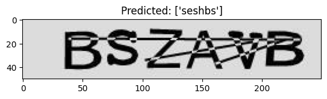
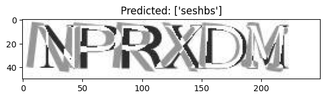
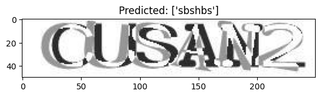

# Captcha-Reader

# OpenCV Approach
using opencv to split the images into individual letters so the model will train on a letter image one by one instead of a whole captcha.

## Dataset
Dataset used in this project: [captcha_images.zip](https://drive.google.com/file/d/1VyaFnIwxNPGkJirxbVhLsTLMVV-33Kb_/view?usp=sharing)
- dataset has 10k images of 4 letters captcha
- dataset has no labels
- dataset is obtained through this tutorial: [click here](https://medium.com/@ageitgey/how-to-break-a-captcha-system-in-15-minutes-with-machine-learning-dbebb035a710)

## Files
- opencv_captcha_reader.ipynb: notebook file to load and preprocess image also to train model
- display_image.ipynb: notebook file to display image
- captcha_model.h5: trained model
- model_labels.dat: labels extracted from the processed images.

# Tensorflow Approach
## Dataset
Dataset used in this project: [captcha_dataset](https://www.kaggle.com/datasets/johnbergmann/captcha-image-dataset/code)
- dataset has 10k images of 6 letters captcha
- dataset has no labels

## Files
- captcha-images: images of example captcha
- predict_images: images of predicted example captcha
- captcha-reader.ipynb: notebook file to train model

## Example Image

## Conclusion
The model need to be improved to be able to get more accurate prediction.