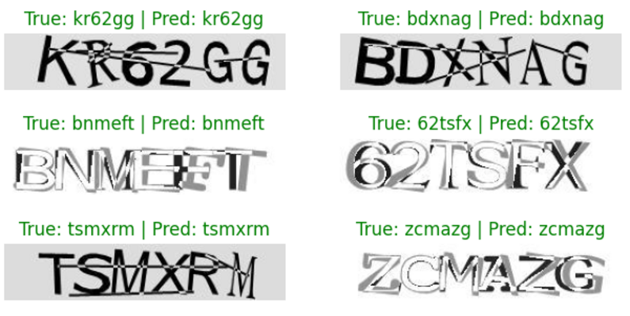
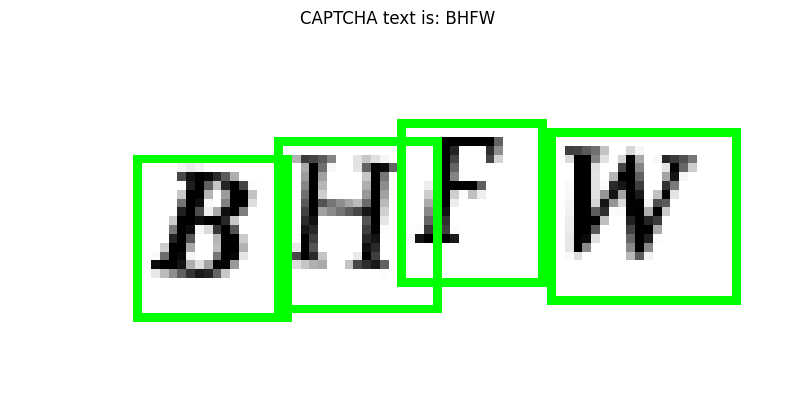
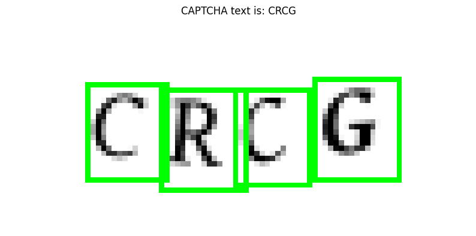
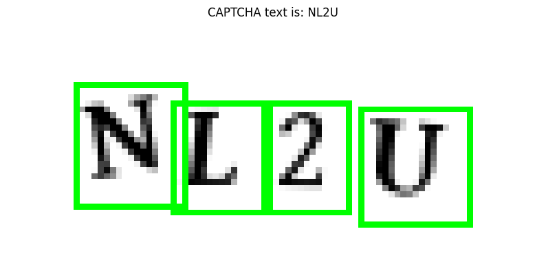
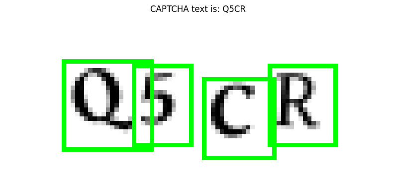
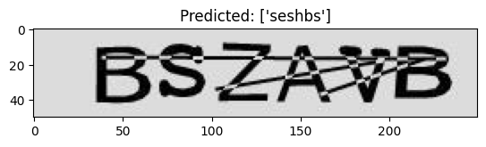

# Captcha-Reader

# OpenCV Approach
using opencv to split the images into individual letters so the model will train on a letter image one by one instead of a whole captcha.

## Dataset
Dataset used in this project: [captcha_images.zip](https://drive.google.com/file/d/1VyaFnIwxNPGkJirxbVhLsTLMVV-33Kb_/view?usp=sharing)
- dataset has 10k images of 4 letters captcha
- dataset has no labels
- dataset is obtained through this tutorial: [click here](https://medium.com/@ageitgey/how-to-break-a-captcha-system-in-15-minutes-with-machine-learning-dbebb035a710)

## Files
- predict_images: folder containing images from prediction result
- opencv_captcha_reader.ipynb: notebook file to load and preprocess image also to train model
- captcha_reader_testing.ipynb: notebook file to get prediction from captcha images
- display_image.ipynb: notebook file to display image
- captcha_model.keras: trained model
- model_labels.dat: labels extracted from the processed images.

## Result

## Conclusion
The model is able to give correct prediction because the data preprocessing makes the project simpler because the model only need to train on one letter per image which have 32 label.

# Tensorflow Approach
Using a TensorFlow model without data preprocessing which causes the model to have complex structure since the data is not preprocessed correctly and causing each image to have 6 * 36 label of alphanumeric.

## Dataset
Dataset used in this project: [kaggle_captcha_dataset](https://www.kaggle.com/datasets/johnbergmann/captcha-image-dataset/code)
- dataset has 10k images of 6 letters captcha
- dataset has no labels

## Files
- captcha-images: images of example captcha
- predict_images: images of predicted example captcha
- captcha-reader.ipynb: notebook file to train model

## Result

## Conclusion
The model in the **TensorFlow Approach** need to be improved or need better data preprocessing technique to be able to get more accurate prediction. Unfortunately the dataset isn't able to be processed correctly like in the **OpenCV Approach**